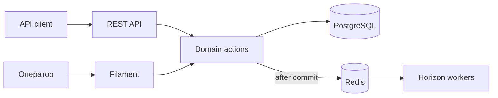

# Order Flow


Order Flow — Laravel-приложение для управления заказами и складскими остатками. В проекте есть REST API, панель оператора, журнал движений товара и фоновые уведомления.

При создании заказа товар резервируется в транзакции. При отмене остаток возвращается, а каждое изменение сохраняется в журнале.

## Что реализовано

- REST API v1 с Sanctum, фильтрацией, сортировкой и OpenAPI-документацией;
- создание, обработка, завершение и отмена заказов;
- атомарное резервирование и возврат товара;
- журнал движений с остатками до и после операции;
- Filament-панель для работы с каталогом, заказами и складом;
- Redis/Horizon для уведомлений, Telescope и `X-Operation-ID` для диагностики.

## Как устроено

### Транзакционная целостность складских остатков

Создание и отмена заказа выполняются в PostgreSQL-транзакции. Строки остатков блокируются через `SELECT ... FOR UPDATE` в одинаковом порядке, а ограничения базы не позволяют сохранить отрицательный остаток или некорректное движение.

### Аудит складских операций

Списание, возврат и ручная корректировка записываются в `stock_movements`: с количеством до и после операции, заказом, типом движения и пользователем.

### Асинхронная обработка уведомлений

Фоновые задачи запускаются после commit. Ошибка почты или очереди не откатывает уже созданный заказ; для повторных попыток настроены retries, backoff и защита от дубликатов.



## Стек

| Область | Технологии |
| --- | --- |
| Backend | PHP 8.5, Laravel 13 |
| Данные | PostgreSQL 18, Redis |
| API | REST, Sanctum, OpenAPI, Spatie Query Builder |
| Панель оператора | Filament 5 |
| Фоновые задачи | Laravel Queue, Horizon |
| Качество | Pest, Larastan, Pint, GitHub Actions |
| Локальная среда | Docker Compose, Laravel Sail, Mailpit |

## Запуск

Понадобятся Git, Docker и Docker Compose v2. PHP и Composer на хосте не требуются: зависимости устанавливаются Composer, включённым в образ с PHP 8.5.

На Windows используйте Docker Desktop с включённой WSL-интеграцией. Храните проект в файловой системе WSL, например в `~/projects`, а не в `/mnt/c` или `/mnt/d`. Все команды ниже выполняются в терминале WSL.

```bash
mkdir -p ~/projects
cd ~/projects
git clone https://github.com/dmitbolo/order-flow.git
cd order-flow

cp .env.example .env

export WWWUSER="$(id -u)"
export WWWGROUP="$(id -g)"

docker compose run --rm --build --no-deps laravel.test \
  composer install --no-interaction --prefer-dist
docker compose up -d --wait
docker compose exec -T laravel.test php artisan key:generate
docker compose exec -T laravel.test php artisan migrate --seed
```

Seeder создаёт администратора и готовый набор данных: склады, товары, остатки, заказы в разных статусах и согласованный журнал движений.

```text
Email:    test@example.com
Password: password
```

| Сервис | Адрес |
| --- | --- |
| Главная | <http://localhost> |
| Панель оператора | <http://localhost/admin> |
| Swagger UI | <http://localhost/api/documentation> |
| Horizon | <http://localhost/horizon> |
| Telescope | <http://localhost/telescope> |
| Mailpit | <http://localhost:8025> |

Демо-доступ предназначен только для локального окружения. Чтобы вернуть исходный набор данных, выполните `docker compose exec -T laravel.test php artisan migrate:fresh --seed`. Команда удалит существующие данные.

## Пример API-запроса

```bash
curl -X POST http://localhost/api/v1/login \
  -H "Content-Type: application/json" \
  -d '{"email":"test@example.com","password":"password"}'
```

В ответ придёт Sanctum token. Остальные запросы и схемы ответов доступны в Swagger UI.

## Проверка

```bash
docker compose exec -T laravel.test composer check
```

Команда запускает Pint, Larastan level 7 и все Pest-тесты.

## Куда смотреть в коде

- [`CreateOrderAction`](app/Actions/Orders/CreateOrderAction.php) — создание заказа и резервирование товара;
- [`LockStockAction`](app/Actions/Stock/LockStockAction.php) — блокировка и проверка остатков;
- [`ApplyStockMovementAction`](app/Actions/Stock/ApplyStockMovementAction.php) — изменение остатка и запись в журнал;
- [`CheckLowStock`](app/Jobs/CheckLowStock.php) — проверка критических остатков в очереди;
- [`DemoDataSeeder`](database/seeders/DemoDataSeeder.php) — воспроизводимый демонстрационный набор;
- [`OrderCreatedWorkflowTest`](tests/Feature/Orders/OrderCreatedWorkflowTest.php) — проверка after-commit сценариев и сбоев инфраструктуры.
